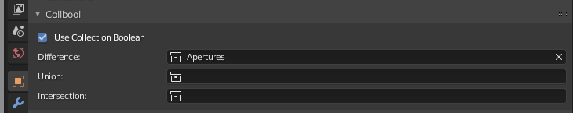

# CollBool
CollBool is an addon for [Blender](https://blender.org/) that allows you to do auto booleans with collections!

## Why?

Because you might want to apply a lot of booleans on one object. For example add a lot of windows onto your virtual building, but adding them all by hand is tedious. You can, of course, unite all windows into one mesh and do a single boolean, but it takes away a lot of flexibility with editing them.

Luckily, with CollBool adding large quantities of booleans is as easy as copying an object!

## Installation

1. Download latest release from [releases page](https://github.com/cmd410/CollBool/releases)
2. Open Blender 2.8 or higher
3. Navigate to `edit -> preferences -> addons`
4. Click `Install...` button and choose the downloaded zip archive
5. Check `CollBool` addon in the list
6. Enjoy!

## Usage

1. Create a collection for your boolean objects
2. Select object you want to use booleans on
3. Go into `Object properties -> Collbool` tab
4. Check `Use Collection Boolean` and in appeared option choose a collection with your boolean objects 
5. Now any mesh that you add inside this collection will do a boolean operation on your mesh
